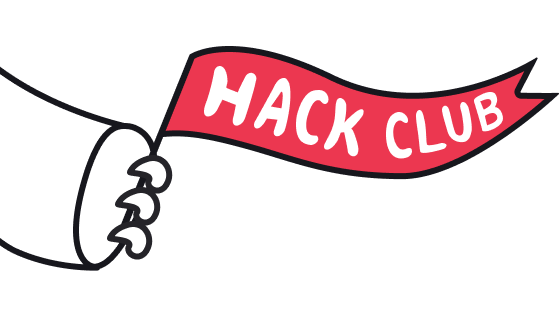

# EYCC CTF 2026 × Mont5ab El2hwa

**Egyptian Youth Cybersecurity Challenge** · Official Challenges & Writeups

---

## About

All challenges, source code, and files from **EYCC CTF 2026** · Egypt's national CTF for students **(Grades 7–13)**.
New to CTFs? Check out [What is a CTF?](https://www.geeksforgeeks.org/ethical-hacking/what-is-ctfs-capture-the-flag/), watch [So, You Wanna Do Security?](https://www.youtube.com/watch?v=i8rizLc4hc0), or follow the [FahemSec Roadmaps](https://fahemsec.com/roadmaps).

| | |
| --- | --- |
| **Organizers** |  [Hack Club of STEM Egypt](https://stemeghackclub.org/) |
| **Partners** |  [Mont5ab El2hwa (منتخب القهوة)](https://2hwa.xyz/) |
| **CTFtime** |  [EYCC Qualifiers](https://ctftime.org/event/3353) · [EYCC Finals](https://ctftime.org/event/3405) |
| **Community** |  [EYCC Server](https://discord.gg/nfyR83h8kC) · [2HWA Server](https://discord.gg/djpMH7sXuX) |

---

## Challenges

All challenges in this repository were created by [Mont5ab El2hwa](https://2hwa.xyz/) · Egyptian CTF players, bug hunters, and security researchers.

- **Reverse Engineering**
  1. [Metoubas v1](reverse/Metoubas-v1.zip)
  2. [Metoubas v2](reverse/Metoubas-v2.zip)
  3. [Metoubas v3](reverse/Metoubas-v3.zip)
  4. [Easy .NET](reverse/Easy.NET.exe)
  5. [Late WarmUp](reverse/Late-WarmUp.exe)
  6. [Normal License Validator](reverse/License-Validator.exe)
  7. [BabyStep](reverse/BabyStep.exe)
  8. [BabyStepV2](reverse/BabyStepV2.exe)
  9. [Operation: GANBAR | Free Photoshop](reverse/Operation-GANBAR-Free-Photoshop.zip)
  10. [Operation: GANBAR | natega.xls](reverse/Operation-GANBAR-natega.xls.zip)

- **Digital Forensics**
  1. [Ghost in the Hall](forensics/ghost-in-the-hall.md)
  2. [Tick Tock](forensics/Tick-Tock.md)
  3. [Trust Issue](forensics/trust-issue.md)
  4. [Silent Access](forensics/Silent-Access.md)
  5. [Operation: GANBAR | TopSecret Fallines](forensics/Operation-GANBAR-TopSecret-Fallines.md)

- **Web Exploitation**
  1. [Mall Albostan](web/mall-albostan_player.7z)
  2. [Brew Bank](web/BREW-BANK_player.7z)
  3. [Brew Bank Revenge](web/BREW-BANK_Revenge_player.7z)
  4. [Krusty Krab Order Boards](web/Krusty-Krab-Order-Boards_player.7z)
  5. [NimbusPages](web/NimbusPages_player.7z)
  6. [Rising Star](web/Rising-Star_player.7z)
  7. [CoffeeHub](web/CoffeeHub_player.7z) *(Blackbox)*
  8. [CoffeeHub Revenge](web/CoffeeHub-Revenge_player.7z) *(Blackbox)*
  9. [shay blaban](#) *(Blackbox)*
  10. [sql? no sql](web/sql-no-sql_player.7z) *(Blackbox)*

- **Mobile Security**
  1. [Warmup](mobile/Warmup.apk)
  2. [Sandy VS Frida](mobile/SandyVSFrida.apk)
  3. [Krusty Krab Vault](mobile/krusty-krab-vault_REAL.apk)
  4. [SpongeBob's Photo Blog](mobile/spongebob-photo-blog_REAL.apk)
  5. [Chainme](mobile/chainme.apk)

- **Cryptography**
  1. [hehe](crypto/hehe.py)
  2. [Spider Man Far From Home](crypto/spider_man_far_from_home.sage)
  3. [The lattice madness](crypto/the_lattice_madness.py)
  4. [babyECDSA](crypto/babyECDSA.py)
  5. [ccrypt](crypto/ccrypt.py)
  6. [Zee Kalmar Playground](crypto/zee_kalmar_playground.py)
  7. [101 RSA](crypto/101-RSA.py)

- **OSINT**
  1. [2Face Graduation](OSINT/2Face-Graduation.md)
  2. [Kazyon](OSINT/Kazyon.md)
  3. [Infected](OSINT/Infected.md)
  4. [NPM NIGHTMARE](OSINT/npm-nightmare.md)
  5. [Infected Revenge](OSINT/Infected-Revenge.md)

- **Binary Exploitation**
  1. [birdguard](pwn/birdguard.7z)
  2. [notekeeper](pwn/notekeeper.7z)
  3. [Wind](pwn/Wind.7z)

- **Miscellaneous**
  1. [Details Never Appear](misc/Details-Never-Appear.txt)
  2. [Look Closer](#)
  3. [Escape From SpongeBob](misc/Escape-From-SpongeBob.png)
  4. [Ghost](misc/Ghost.csv)

> [!NOTE]
> 📝 **Official Writeups**  
> Read full challenge writeups on **[Mont5ab El2hwa × EYCC CTF 2026](https://2hwa.xyz/eycc-ctf-2026)**

---

## Team Credits

| Member | Profile |
| --- | --- |
| Mahmoud Elkhateb | [`@elkhatebx22`](https://2hwa.xyz/member/elkhatebx22) |
| Ibrahim Saeid | [`@babayaga0x01`](https://2hwa.xyz/member/babayaga0x01) |
| Ibrahim (the crypto guy) | [`@vr3e`](https://www.linkedin.com/in/ibrahim-adel-6437b123b/) |
| Abdelrahman Walid | [`@Abdelrahman_483`](https://2hwa.xyz/member/abdelrahman9969) |
| Abdelrahman Radwan | [`@agn4by`](https://2hwa.xyz/member/Agn4by) |
| Abdelrahman Ahmed | [`@0x2face`](https://2hwa.xyz/member/0x2face) |
| Ahmed Sherif | [`@k45w4ra`](https://2hwa.xyz/member/k45w4ra) |
| Ali Sherif | [`@spect3r`](https://2hwa.xyz/member/Spect3r) |
| Adham Khairy | [`@Sponge`](https://2hwa.xyz/member/0xsponge) |
| Omar Elgayar | [`@OG13`](https://2hwa.xyz/member/OG13) |
| Mohamed Younis | [`@mo_younis`](https://2hwa.xyz/member/Y0un15) |
| Mohamed Aly | [`@00xcanelo`](https://2hwa.xyz/member/00xcanelo) |
| Mohamed Hegazy | [`@binbash`](https://2hwa.xyz/member/0xheg3zy) |
| Mahmoud Mostafa | [`@M-Ab0L3TA`](https://2hwa.xyz/member/MAb0EL3TA) |
| Mohamed Bakr | [`@烈火`](https://2hwa.xyz/member/0xreizouko) |
| Mohammed Abdallah | [`@mo.ha08`](#) |

---

## License

This repository and its challenge materials are released under the [MIT License](LICENSE) for educational purposes. All materials and writeups belong to their respective authors and Mont5ab El2hwa.

---

*« إن لم أكن قهوجي، لوددت أن أكون قهوجي »*

**[Mont5ab El2hwa (منتخب القهوة)](https://2hwa.xyz/)**

